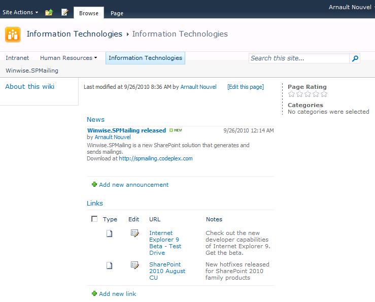
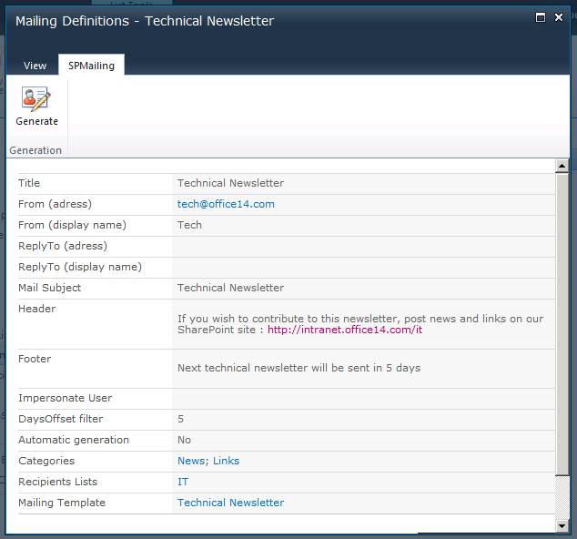
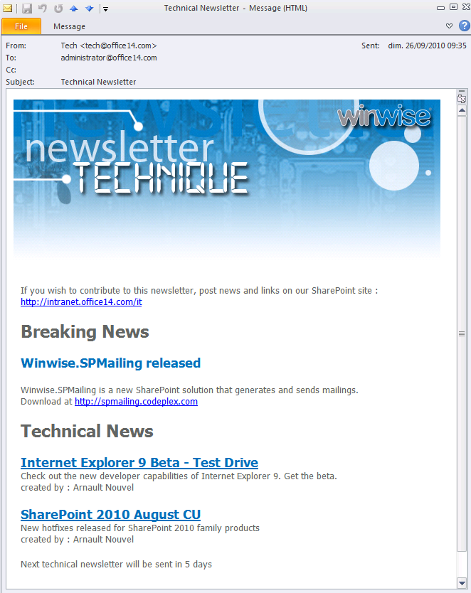

# Winwise.SPMailing
Winwise.SPMailing is a SharePoint 2010 solution that allows users to extract SharePoint content in order to generate mailings (newsletters) and send them. 

[Download wsp file](README/Winwise.SPMailing.wsp)

## Example

Use an announcement list and a links list as repository for newsletter content :

Define categories, select rendering templates :

Then generate a newsletter and send it to site users :

Key features
* Manage distribution lists that can include users, AD groups and regular SharePoint contacts
* Categories architecture is based on user-defined CAML queries
* Images are embedded into emails so it fits extranet scenarios
* Mailings can be generated on a regular basis using an included workflow
* The solution is localized in both english and french
* Powerful logging engine
* Mail templates and category templates are customizable using SharePoint Designer
* Sample templates included for a quick start
* Specify a specific user account to impersonate for generation : security is applied
* Queries are limited to the current site collection (security)
* SPMailing feature can only be activated by a site collection administrator (security)

*Originaly hosted on CodePlex with 1500+ downloads*